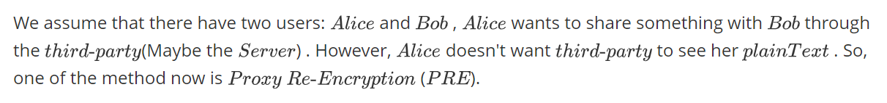
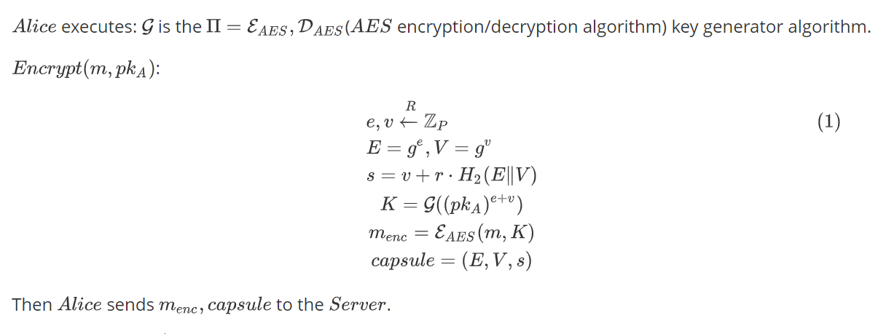
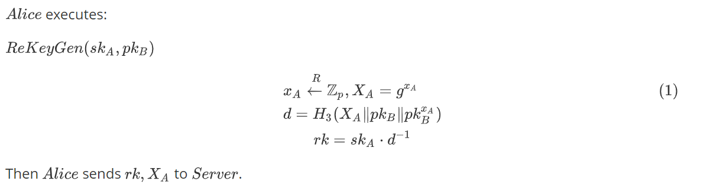
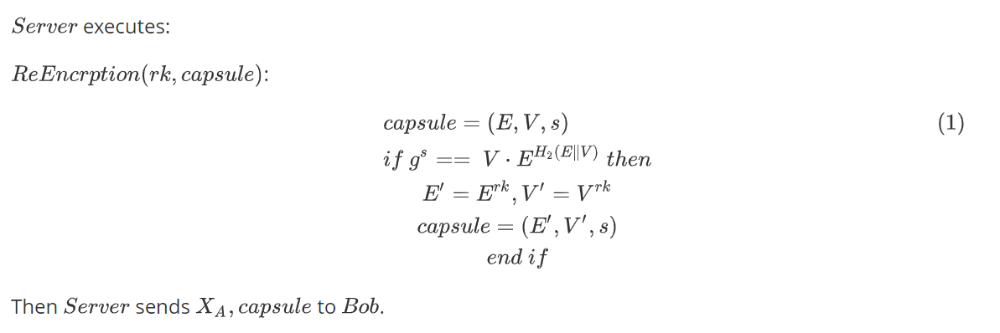
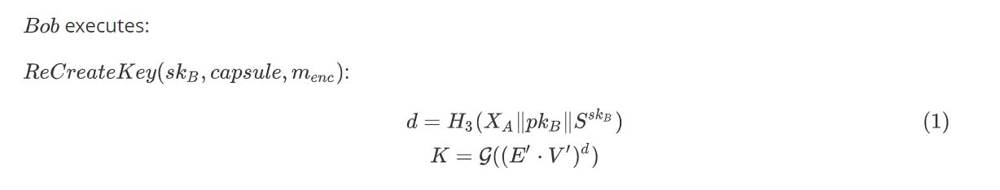
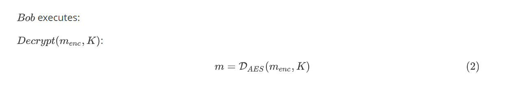

# goRecrypt
`goRecrypt` is a tool to execute proxy re-encryption algorithms. It offers a high-level API to easily implement the process of re-encryption.

# Introduction and Theory



## Prerequisites


## Encrypt



## ReKeyGen



## ReEncryption



## ReCreateKey



## Decrypt



# Getting started

## Install

```sh
$ go get -v github.com/SherLzp/goRecrypt
```

## Test

### Code

```go
package main

import (
	"fmt"
	"goRecrypt/curve"
	"goRecrypt/recrypt"
)

func main() {
	// Alice Generate Alice key-pair
	aPriKey, aPubKey, _ := curve.GenerateKeys()
	// Bob Generate Bob key-pair
	bPriKey, bPubKey, _ := curve.GenerateKeys()
	// plain text
	m := "Hello, Proxy Re-Encryption"
	fmt.Println("origin message:", m)
	// Alice encrypts to get cipherText and capsule
	cipherText, capsule, err := recrypt.Encrypt(m, aPubKey)
	if err != nil {
		fmt.Println(err)
	}
	capsuleAsBytes, err := recrypt.EncodeCapsule(*capsule)
	if err != nil {
		fmt.Println("encode error:", err)
	}
	capsuleTest, err := recrypt.DecodeCapsule(capsuleAsBytes)
	if err != nil {
		fmt.Println("decode error:", err)
	}
	fmt.Println("capsule before encode:", capsule)
	fmt.Println("capsule after decode:", capsuleTest)
	fmt.Println("ciphereText:", cipherText)
	// Alice generates re-encryption key
	rk, pubX, err := recrypt.ReKeyGen(aPriKey, bPubKey)
	if err != nil {
		fmt.Println(err)
	}
	fmt.Println("rk:", rk)
	// Server executes re-encrypt
	newCapsule, err := recrypt.ReEncryption(rk, capsule)
	if err != nil {
		fmt.Println(err.Error())
	}
	// Bob decrypts the cipherText
	plainText, err := recrypt.Decrypt(bPriKey, newCapsule, pubX, cipherText)
	if err != nil {
		fmt.Println(err)
	}

	plainTextByMyPri, err := recrypt.DecryptOnMyPriKey(aPriKey, capsule, cipherText)
	if err != nil {
		fmt.Println(err)
	}
	fmt.Println("PlainText by my own private key:", string(plainTextByMyPri))
	// get plainText
	fmt.Println("plainText:", string(plainText))

	fileCapsule, err := recrypt.EncryptFile("a.txt", "a_encrypt.txt", aPubKey)
	if err != nil {
		fmt.Println("File Encrypt Error:", err)
	}
	fileNewCapsule, err := recrypt.ReEncryption(rk, fileCapsule)
	if err != nil {
		fmt.Println("ReEncryption Error:", err)
	}
	err = recrypt.DecryptFile("a_encrypt.txt", "a_decrypt.txt", bPriKey, fileNewCapsule, pubX)
	if err != nil {
		fmt.Println("Decrypt Error:", err)
	}
}
```

### Result

```go
origin message: Hello, Proxy Re-Encryption
capsule before encode: &{0xc00006af60 0xc00006af90 57148977540300415262115486025741185922481513775009103033079547516801934630957}
capsule after decode: {0xc0000ea0c0 0xc0000ea440 57148977540300415262115486025741185922481513775009103033079547516801934630957}
ciphereText: [86 253 12 148 28 55 88 28 29 24 102 154 207 74 186 228 38 187 250 136 195 231 55 137 34 143 29 145 161 117 217 125 227 233 43 63 182 218 66 181 217 102]
rk: 102993116644991623703962027935370616042568913513173132988315879311078971457909
PlainText by my own private key: Hello, Proxy Re-Encryption
plainText: Hello, Proxy Re-Encryption
```

Thanks! 